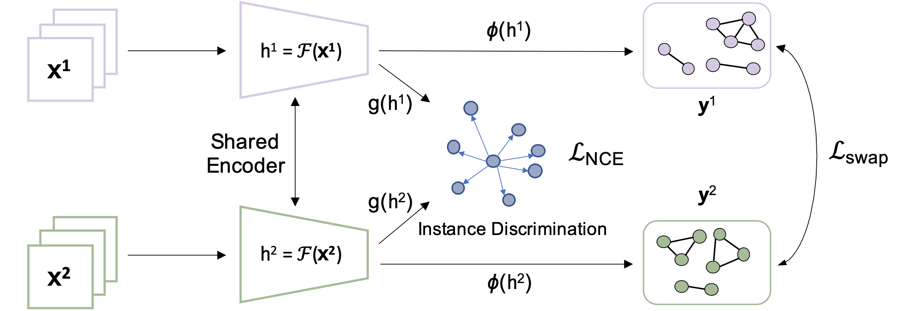

## Weakly Supervised Contrastive Learning


This repository contains PyTorch evaluation code, training code and pretrained models for WCL.

For details see [Weakly Supervised Contrastive Learning](https://) by Mingkai Zheng, Shan You, Fei Wang, Chen Qian, Changshui Zhang, Xiaogang Wang and Chang Xu




## Reproducing
To run the code, you probably need to change the Dataset setting (dataset/imagenet.py), and Pytorch DDP setting (util/dist_init.py) for your own server enviroments.

The distribued training of this code is base on slurm enviroments, we have provide the training scrips under the script folder.

In this code, we adopt a hidden dimension of 4096 and output dimension 256 for the projection head (we use 2048 and 128 in our paper) since we found the performance can be further improved a little bit.

|          |Arch | BatchSize | Epochs | Linear Eval | Linear Eval (Paper) | Download  |
|----------|:----:|:---:|:---:|:---:|:---:|:---:|
|  WCL | ResNet50 | 4096 | 100  | 68.5 % | 68.1 % | [wcl-100.pth](https://drive.google.com/file/d/16Ib4rvEvB_rdQThPxkoOb9wvCALzPTZd/view?usp=sharing) |
|  WCL | ResNet50 | 4096 | 200  | 70.5 % | 70.3 % | [wcl-200.pth](https://drive.google.com/file/d/1usvvFAw_1bOaiXBgxXG9kwOOPb0VAy0Y/view?usp=sharing) |
|  WCL | ResNet50 | 4096 | 800  | xx.x % | 72.2 % | [wcl-800.pth](https://drive.google.com/file/d/1usvvFAw_1bOaiXBgxXG9kwOOPb0VAy0Y/view?usp=sharing) |

If you want to test the pretained model, please download the weights from the link above, and move it to the checkpoints folder (create one if you don't have .checkpoints/ directory). The evaluation scripts also has been provided in script/train.sh

<!-- 
## Citation
If you find that ReSSL interesting and help your research, please consider citing it:
```
@misc{zheng2021ressl,
      title={ReSSL: Relational Self-Supervised Learning with Weak Augmentation}, 
      author={Mingkai Zheng and Shan You and Fei Wang and Chen Qian and Changshui Zhang and Xiaogang Wang and Chang Xu},
      year={2021},
      eprint={2107.09282},
      archivePrefix={arXiv},
      primaryClass={cs.CV}
}
```
 -->
